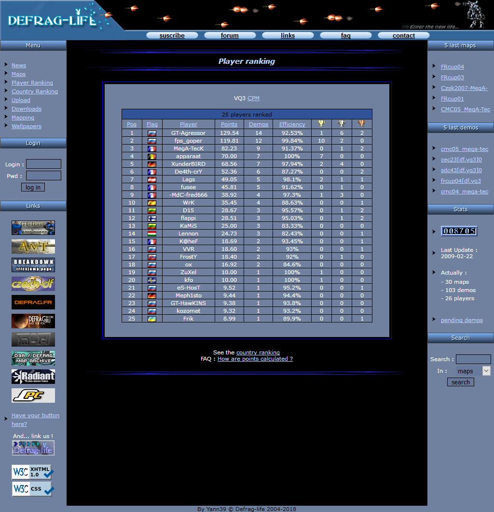

# Defrag-life

My first **PHP** website about the **DeFRaG mod** of the **Quake 3 arena** game.

---

# Table of Contents

* [About the project](#about-the-project)
* [Screenshot](#screenshot)
* [Usage](#usage)
* [Features](#features)
* [License](#license)

# About the project

<table>
  <tr>
    <td>
        
    </td>
    <td>
        
    </td>
  </tr>
</table>

My first **PHP/MySQL** website, build in **early 2000's**.

Still up and running and **W3C strict** compliant !

The website allowed players of the **DeFRaG mod** from the **Quake 3 arena** game to upload their demos (performance
recording) on maps created by me and my brother, so that we can build rankings.

It was also a way to share resources like maps, textures, wallpapers, etc. we liked to create.

# Screenshot

# Usage

Website is accessible at the following address : https://quake.rockybox.net/

The purpose is just to keep a usable snapshot of the website as a _souvenir_ and so it does not become anonymous :)

I moved it "as is" from my old web host so some hardcoded/host-related features are missing, also sorry for kitsch language, we were young :)

# Features

The website provided the following features :

- News list page (paginated) + admin page to submit news
- Map list page + admin page to add maps
  - VQ3/CPM type choice
  - paginated + sortable
  - downloadable files
  - 360 panoramic views (uses PurePlayerPro library)
  - list of players performances per map + downloadable demos
- Search functionality (maps and demos)
- Authenticated section (login / password)
- User upload functionality (allow to upload demos)
- Player and Country ranking
- Forum (removed later)
- Downloadable content (maps, demos, wallpapers, sky models, textures, software)

# License

[General Public License (GPL) v3](https://www.gnu.org/licenses/gpl-3.0.en.html)

This program is free software: you can redistribute it and/or modify it under the terms of the GNU
General Public License as published by the Free Software Foundation, either version 3 of the
License, or (at your option) any later version.

This program is distributed in the hope that it will be useful, but WITHOUT ANY WARRANTY; without
even the implied warranty of MERCHANTABILITY or FITNESS FOR A PARTICULAR PURPOSE. See the GNU
General Public License for more details.

You should have received a copy of the GNU General Public License along with this program.  If not,
see <http://www.gnu.org/licenses/>.